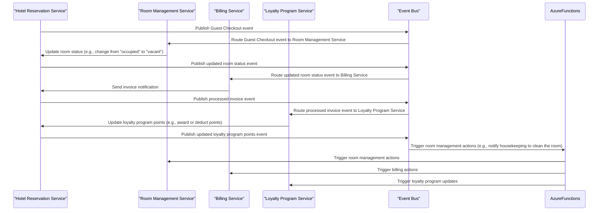

Recently, I've been exploring the benefits of **Event-Driven Architecture (EDA)** in a microservices-based hotel reservation system. This project aims to design an architecture that enables real-time interactions, improves scalability and maintainability, and simplifies integration between services.

This architecture will serve as the foundation upon which I will build the system.

## Event-Driven Architecture: A Definition

Event-Driven Architecture is a software development approach that revolves around producing and consuming events. An event represents an occurrence or state change within a microservice, such as "Room 101 has been reserved" or "Guest 123 has checked out". This architecture allows services to publish and subscribe to these events, enabling real-time interactions and asynchronous communication between services.

## Key Components of EDA

To achieve this goal, I've identified the following key components:

### Domain Events

**Domain Events** represent significant changes within a microservice's domain. These events encapsulate the essence of what has happened (e.g., "Room 101 has been reserved" or "Guest 123 has checked out"). By using domain events, services can react to state changes and update their internal states accordingly.

For example, when a guest checks out, an "Guest Checkout" event is triggered. This event contains the necessary information about the checkout process (e.g., the guest's ID, room number, and checkout date).

### Event Handlers

**Event Handlers** are services that subscribe to events and react to them by performing specific actions. In the case of the "Guest Checkout" event, an event handler might update the guest's status in the database or send a confirmation email.

To further improve performance and reduce costs, I've decided to use **Azure Functions** as event handlers. Azure Functions allows me to write scalable, serverless code that can be triggered by events from various sources (e.g., Azure Storage Queue, Azure Event Grid, or Azure IoT Hub).

By using Azure Functions, I can:

* Scale my event handling capabilities up or down based on demand
* Reduce costs by only paying for the compute time consumed
* Focus on writing code without worrying about infrastructure management

### Event Buses

**Event Buses** are middleware components responsible for distributing events between services. They ensure that events are routed correctly, provide features like message queuing and error handling, and help to mediate the communication between services.

In our hotel reservation system, an event bus would handle the "Guest Checkout" event by routing it to the relevant Azure Functions (e.g., room management, billing, and loyalty programs). This allows each service to react independently without affecting others.

### Event Sourcing

**Event Sourcing** is a pattern that involves storing the history of events related to a specific domain concept. For example, when a guest checks out, the event sourcing mechanism would store the "Guest Checkout" event along with its relevant information (e.g., the guest's ID, room number, and checkout date).

This approach enables auditing, debugging, and business reporting capabilities. By reconstructing the sequence of events, developers can analyze system behavior, detect anomalies, or perform impact assessments.

## Benefits Achieved

By implementing EDA on Azure with Azure Functions as event handlers, we've gained:

* **Real-time Interactions**: Services can react to changes instantly, improving response times for users.
* **Scalability**: As services operate independently, the system can handle increased traffic more efficiently.
* **Decoupling**: Services no longer rely on each other's availability, reducing the risk of cascading failures and making it easier to maintain or replace individual services.
* **Flexibility**: The architecture allows for easy addition or removal of services without affecting the overall system.
* **Cost Efficiency**: Azure Functions helps reduce costs by only paying for the compute time consumed.

## Diagram

Here is a Mermaid diagram that explains the flow of events in our hotel reservation system:

This diagram shows the flow of events from the Hotel Reservation Service to various downstream services, including Room Management, Billing, and Loyalty Program. The Event Bus plays a central role in routing these events between services.

The Azure Functions participant represents the serverless code that can be triggered by these events to perform specific actions (e.g., room management, billing, or loyalty program updates).

I hope this diagram helps illustrate the flow of events in our hotel reservation system!

## Next Steps

I will continue sharing progress and the challenges I encounter throughout the development of this system.

💬 **What other strategies do you use to improve the architecture and maintainability of your microservices?**

📌 You can follow the project's development in my GitHub repository: [GitHub repository](https://github.com/TempooDev/Booking)

---
_Thank you for reading! I hope this experience can serve as inspiration for your own projects!_
