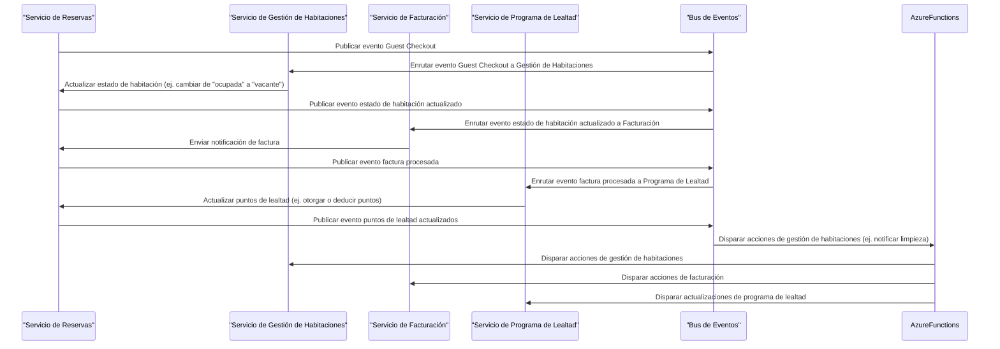

Recientemente, he estado explorando los beneficios de la **Arquitectura Orientada a Eventos (EDA)** en un sistema de reservas hoteleras basado en microservicios. Este proyecto tiene como objetivo diseñar una arquitectura que permita interacciones en tiempo real, mejore la escalabilidad y mantenibilidad, y simplifique la integración entre servicios.

Esta arquitectura servirá como base sobre la cual construiré el sistema.

## Arquitectura Orientada a Eventos: Una Definición

La Arquitectura Orientada a Eventos es un enfoque de desarrollo de software que gira en torno a la producción y consumo de eventos. Un evento representa una ocurrencia o cambio de estado dentro de un microservicio, como "Habitación 101 ha sido reservada" o "Huésped 123 ha hecho check-out". Esta arquitectura permite a los servicios publicar y suscribirse a estos eventos, habilitando interacciones en tiempo real y comunicación asíncrona entre servicios.

## Componentes Clave de EDA

Para lograr este objetivo, he identificado los siguientes componentes clave:

### Eventos de Dominio

Los **Eventos de Dominio** representan cambios significativos dentro del dominio de un microservicio. Estos eventos encapsulan la esencia de lo que ha sucedido (por ejemplo, "Habitación 101 ha sido reservada" o "Huésped 123 ha hecho check-out"). Al usar eventos de dominio, los servicios pueden reaccionar a cambios de estado y actualizar sus estados internos en consecuencia.

Por ejemplo, cuando un huésped hace check-out, se dispara un evento "Guest Checkout". Este evento contiene la información necesaria sobre el proceso de salida (por ejemplo, el ID del huésped, número de habitación y fecha de salida).

### Manejadores de Eventos (Event Handlers)

Los **Manejadores de Eventos** son servicios que se suscriben a eventos y reaccionan a ellos realizando acciones específicas. En el caso del evento "Guest Checkout", un manejador de eventos podría actualizar el estado del huésped en la base de datos o enviar un correo de confirmación.

Para mejorar aún más el rendimiento y reducir costes, he decidido usar **Azure Functions** como manejadores de eventos. Azure Functions me permite escribir código escalable y serverless que puede ser disparado por eventos de varias fuentes (por ejemplo, Azure Storage Queue, Azure Event Grid, o Azure IoT Hub).

Al usar Azure Functions, puedo:

* Escalar mis capacidades de manejo de eventos hacia arriba o abajo según la demanda
* Reducir costes pagando solo por el tiempo de computación consumido
* Centrarme en escribir código sin preocuparme por la gestión de infraestructura

### Buses de Eventos

Los **Buses de Eventos** son componentes middleware responsables de distribuir eventos entre servicios. Aseguran que los eventos se enruten correctamente, proporcionan características como colas de mensajes y manejo de errores, y ayudan a mediar la comunicación entre servicios.

En nuestro sistema de reservas hoteleras, un bus de eventos manejaría el evento "Guest Checkout" enrutándolo a las Azure Functions relevantes (por ejemplo, gestión de habitaciones, facturación y programas de lealtad). Esto permite que cada servicio reaccione independientemente sin afectar a los demás.

### Event Sourcing

**Event Sourcing** es un patrón que implica almacenar el historial de eventos relacionados con un concepto de dominio específico. Por ejemplo, cuando un huésped hace check-out, el mecanismo de event sourcing almacenaría el evento "Guest Checkout" junto con su información relevante (por ejemplo, el ID del huésped, número de habitación y fecha de salida).

Este enfoque habilita capacidades de auditoría, depuración y reportes de negocio. Al reconstruir la secuencia de eventos, los desarrolladores pueden analizar el comportamiento del sistema, detectar anomalías o realizar evaluaciones de impacto.

## Beneficios Logrados

Al implementar EDA en Azure con Azure Functions como manejadores de eventos, hemos ganado:

* **Interacciones en tiempo real**: Los servicios pueden reaccionar a cambios instantáneamente, mejorando los tiempos de respuesta para los usuarios.
* **Escalabilidad**: Como los servicios operan independientemente, el sistema puede manejar el aumento de tráfico de manera más eficiente.
* **Desacoplamiento**: Los servicios ya no dependen de la disponibilidad de los demás, reduciendo el riesgo de fallos en cascada y facilitando el mantenimiento o reemplazo de servicios individuales.
* **Flexibilidad**: La arquitectura permite añadir o eliminar servicios fácilmente sin afectar al sistema general.
* **Eficiencia de Costes**: Azure Functions ayuda a reducir costes pagando solo por el tiempo de computación consumido.

## Diagrama

Aquí tienes un diagrama Mermaid que explica el flujo de eventos en nuestro sistema de reservas hoteleras:

Este diagrama muestra el flujo de eventos desde el Servicio de Reservas Hoteleras a varios servicios downstream, incluyendo Gestión de Habitaciones, Facturación y Programa de Lealtad. El Bus de Eventos juega un papel central en el enrutamiento de estos eventos entre servicios.

El participante Azure Functions representa el código serverless que puede ser disparado por estos eventos para realizar acciones específicas (por ejemplo, gestión de habitaciones, facturación o actualizaciones del programa de lealtad).

¡Espero que este diagrama ayude a ilustrar el flujo de eventos en nuestro sistema de reservas hoteleras!

## Próximos Pasos

Continuaré compartiendo el progreso y los desafíos que encuentre a lo largo del desarrollo de este sistema.

💬 **¿Qué otras estrategias usas para mejorar la arquitectura y mantenibilidad de tus microservicios?**

📌 Puedes seguir el desarrollo del proyecto en mi repositorio de GitHub: [GitHub repository](https://github.com/TempooDev/Booking)

---
_¡Gracias por leer! ¡Espero que esta experiencia pueda servir de inspiración para tus propios proyectos!_
