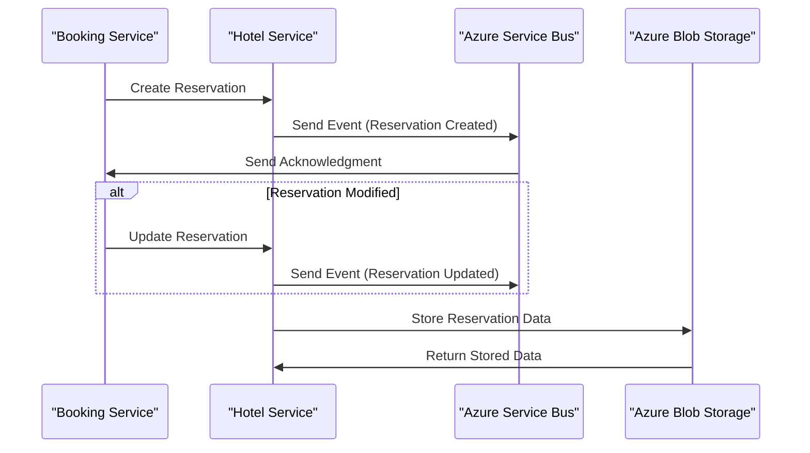
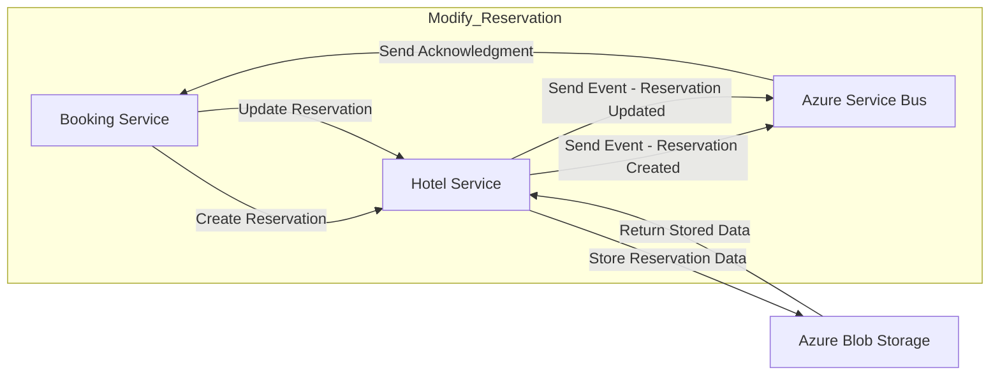

## Introduction

In today's digital age, hospitality companies are under pressure to provide seamless guest experiences. To achieve this, they require a robust hotel reservation system that can handle high volumes of bookings, modifications, and cancellations efficiently. A well-designed microservices architecture can help address these challenges by breaking down the system into smaller, independent services that communicate with each other asynchronously.

## Microservices Architecture

Our project implements a microservices architecture using .NET Aspire to simplify infrastructure creation and enhanceobservability. It consists of two main services: **Booking** and **Hotel**, designed to manage reservations in a hotel chain.

## Description

This sequence diagram illustrates the communication flow between the **Booking Service**, **Hotel Service**, **Azure Service Bus**, and **Azure Blob Storage**. When a new reservation is created, the **Booking Service** sends a request to the **Hotel Service**, which then publishes an event to the **Azure Service Bus**. The **Azure Service Bus** acknowledges receipt of the event and stores it for later processing. Similarly, when a reservation is modified, the **Booking Service** updates the reservation and sends an event to the **Azure Service Bus**, which then triggers further processing in the **Hotel Service**.

### Booking Service

The **Booking** service is responsible for managing bookings, including creating new reservations, updating existing ones, and canceling reservations. This service uses a RESTful API to handle incoming requests from the front-end application or other services. When a new reservation is created through the **Booking** service API, an event is published to an **Azure Service Bus**, triggering a background process in the **Hotel** service.

### Hotel Service

The **Hotel** service includes a background process that listens for events published by the **Booking** service and stores relevant information in an **Azure Blob Storage**. This allows the hotel management team to analyze booking patterns, room utilization, and other key performance indicators (KPIs) without impacting the booking process.

### Azure Service Bus

Integrating **Azure Service Bus** in .NET Aspire facilitates connection with instances of this service from .NET applications, enabling efficient communication between microservices. This messaging mechanism allows for asynchronous communication between services, ensuring that each service remains decoupled and maintainable.

### Azure Blob Storage

Similarly, integration with **Azure Blob Storage** allows for scalable and secure management and storage of largevolumes of unstructured data, such as images or documents associated with room reservations.

#### Benefits

This modular and decoupled approach enhances the system's scalability and maintainability, allowing each service to evolve independently according to business needs. Additionally, by leveraging **Azure Service Bus** and **Azure Blob Storage**, our architecture provides:

* Asynchronous communication between services
* Scalable data storage and management
* Enhanced observability and monitoring capabilities

## Conclusion

In this post, we explored the design of a microservices-based hotel reservation system using .NET Aspire, Azure Service Bus, and Azure Blob Storage. This scalable and maintainable architecture enables efficient booking processing, event-driven communication, and large-scale data storage.

To learn more about this project or explore the code, visit the [GitHub repository](https://github.com/TempooDev/Booking).
