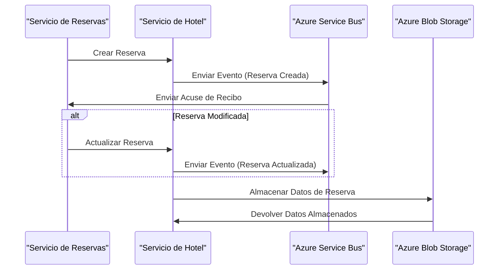
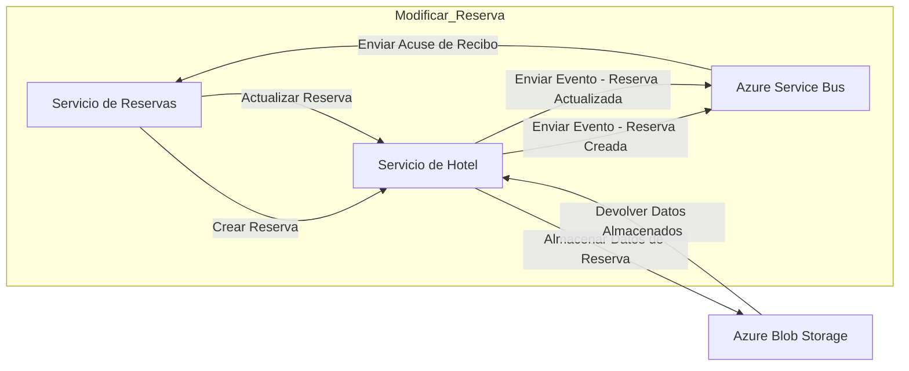

## Introducción

En la era digital actual, las empresas hoteleras están bajo presión para proporcionar experiencias de huésped fluidas. Para lograr esto, requieren un sistema de reservas hoteleras robusto que pueda manejar altos volúmenes de reservas, modificaciones y cancelaciones de manera eficiente. Una arquitectura de microservicios bien diseñada puede ayudar a abordar estos desafíos dividiendo el sistema en servicios más pequeños e independientes que se comunican entre sí de forma asíncrona.

## Arquitectura de Microservicios

Nuestro proyecto implementa una arquitectura de microservicios utilizando .NET Aspire para simplificar la creación de infraestructura y mejorar la observabilidad. Consiste en dos servicios principales: **Booking** y **Hotel**, diseñados para gestionar reservas en una cadena hotelera.

## Descripción

Este diagrama de secuencia ilustra el flujo de comunicación entre el **Servicio de Reservas**, **Servicio de Hotel**, **Azure Service Bus**, y **Azure Blob Storage**. Cuando se crea una nueva reserva, el **Servicio de Reservas** envía una solicitud al **Servicio de Hotel**, que luego publica un evento en el **Azure Service Bus**. El **Azure Service Bus** acusa recibo del evento y lo almacena para su procesamiento posterior. De manera similar, cuando se modifica una reserva, el **Servicio de Reservas** actualiza la reserva y envía un evento al **Azure Service Bus**, que luego dispara un procesamiento adicional en el **Servicio de Hotel**.

### Servicio de Reservas (Booking Service)

El servicio de **Booking** es responsable de gestionar las reservas, incluyendo la creación de nuevas reservas, actualización de las existentes y cancelación de reservas. Este servicio utiliza una API RESTful para manejar las solicitudes entrantes desde la aplicación frontend u otros servicios. Cuando una nueva reserva se crea a través de la API del servicio de **Booking**, se publica un evento en un **Azure Service Bus**, disparando un proceso en segundo plano en el servicio de **Hotel**.

### Servicio de Hotel (Hotel Service)

El servicio de **Hotel** incluye un proceso en segundo plano que escucha los eventos publicados por el servicio de **Booking** y almacena la información relevante en un **Azure Blob Storage**. Esto permite al equipo de gestión del hotel analizar patrones de reserva, utilización de habitaciones y otros indicadores clave de rendimiento (KPIs) sin impactar el proceso de reserva.

### Azure Service Bus

Integrar **Azure Service Bus** en .NET Aspire facilita la conexión con instancias de este servicio desde aplicaciones .NET, habilitando una comunicación eficiente entre microservicios. Este mecanismo de mensajería permite la comunicación asíncrona entre servicios, asegurando que cada servicio permanezca desacoplado y mantenible.

### Azure Blob Storage

De manera similar, la integración con **Azure Blob Storage** permite una gestión y almacenamiento escalable y seguro de grandes volúmenes de datos no estructurados, como imágenes o documentos asociados con las reservas de habitaciones.

#### Beneficios

Este enfoque modular y desacoplado mejora la escalabilidad y mantenibilidad del sistema, permitiendo que cada servicio evolucione independientemente según las necesidades del negocio. Además, al aprovechar **Azure Service Bus** y **Azure Blob Storage**, nuestra arquitectura proporciona:

* Comunicación asíncrona entre servicios
* Almacenamiento y gestión de datos escalable
* Capacidades mejoradas de observabilidad y monitoreo

## Conclusión

En este post, exploramos el diseño de un sistema de reservas hoteleras basado en microservicios utilizando .NET Aspire, Azure Service Bus y Azure Blob Storage. Esta arquitectura escalable y mantenible permite un procesamiento de reservas eficiente, comunicación orientada a eventos y almacenamiento de datos a gran escala.

Para aprender más sobre este proyecto o explorar el código, visita el [repositorio de GitHub](https://github.com/TempooDev/Booking).
